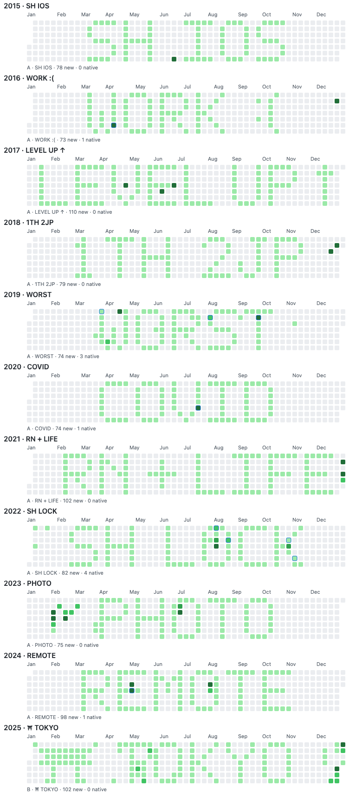

# GitHub Contribution Art

Pixel art drawn on my GitHub contribution calendar.

The commits in this repository are deliberately backdated empty commits used as pixels. They do not represent historical coding activity.

## Timeline

| Year | Memory | Artwork |
| --- | --- | --- |
| 2015 | Shanghai and the beginning of my iOS career | `SH IOS` |
| 2016 | Working life, with dry humor | `WORK :(` |
| 2017 | Rapid technical growth | `LEVEL UP ↑` |
| 2018 | Thailand once and Japan twice | `1TH 2JP` |
| 2019 | The hardest year | `WORST` |
| 2020 | The pandemic year | `COVID` |
| 2021 | React Native and a new phase of life | `RN + LIFE` |
| 2022 | Shanghai lockdown | `SH LOCK` |
| 2023 | Photography | `PHOTO` |
| 2024 | Remote work | `REMOTE` |
| 2025 | Moving to Tokyo | `TOKYO` |



## Reproducibility

- `designs/` contains the selected 7-row bitmap for each year.
- `pixels.json` contains every intentionally selected empty contribution date.
- `phase1-snapshot.json` records the occupied dates observed before generation.
- `generate.py --dry-run` prints the commits without changing Git history.
- `verify.py` compares the art commits with the design data and checks the original-calendar collision snapshot.

Generate only in a dedicated repository:

```sh
python3 generate.py --dry-run
python3 generate.py
python3 verify.py
```

